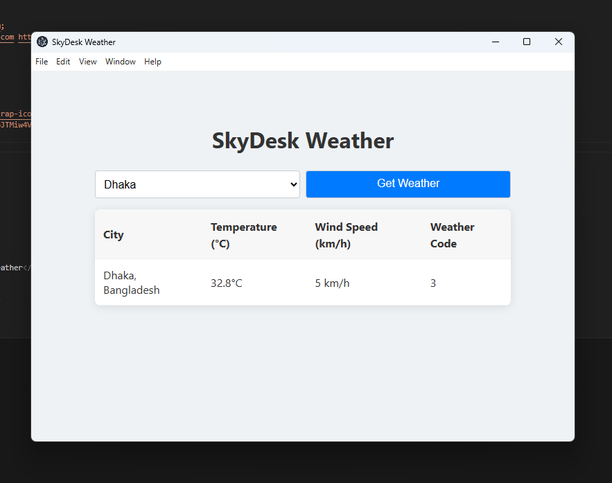

# SkyDesk

## Overview
SkyDesk is an Electron-based desktop weather application that fetches and displays current weather information for selected cities using the Open-Meteo API.

## Clone from GitHub
```bash
git clone https://github.com/yourusername/skydesk.git
cd skydesk
```

## Run Locally
```bash
npm install
npm start
```

## Build for Desktop
```bash
npx electron-packager . SkyDesk --platform=win32,darwin,linux --arch=x64 --out=dist/
```

## Screenshot

